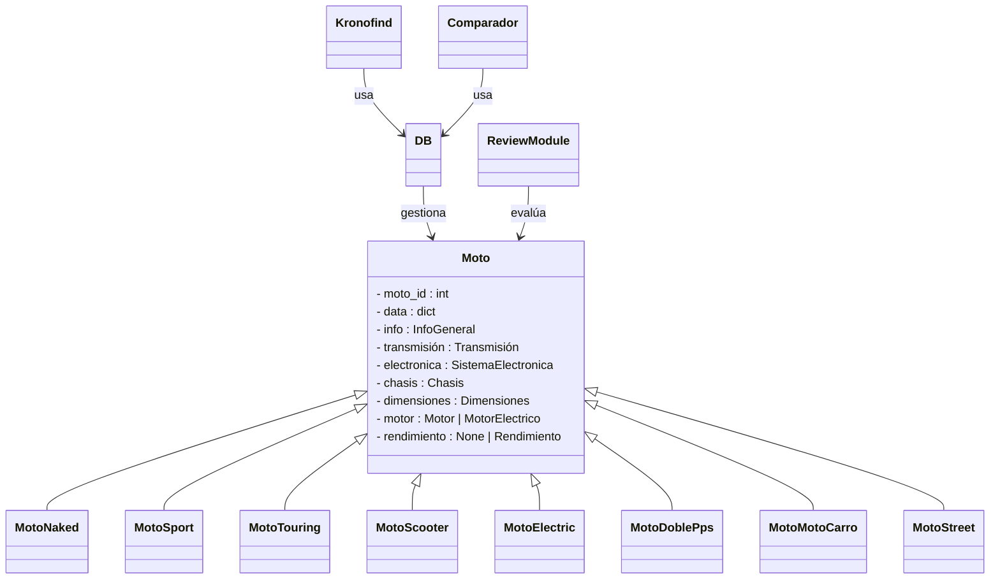
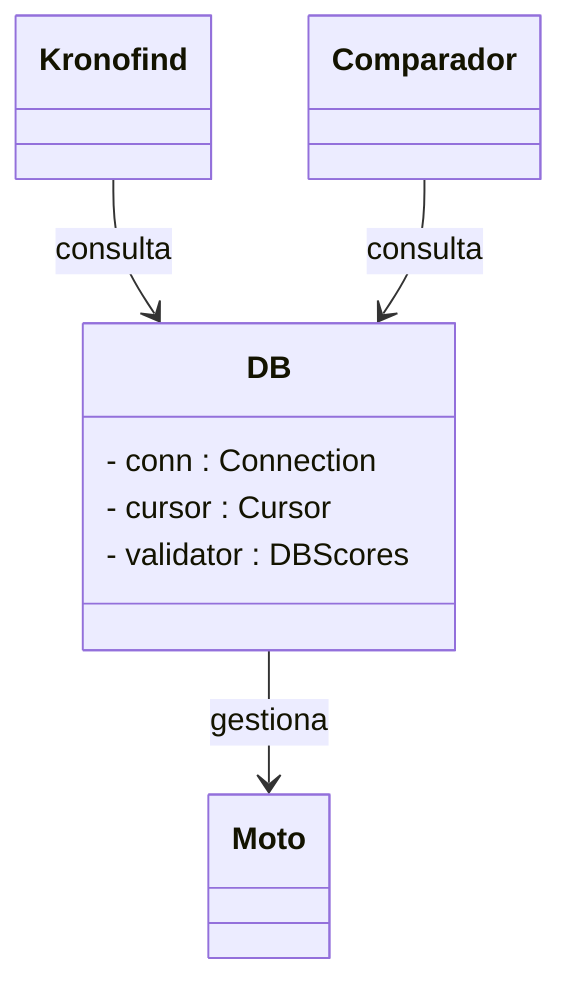
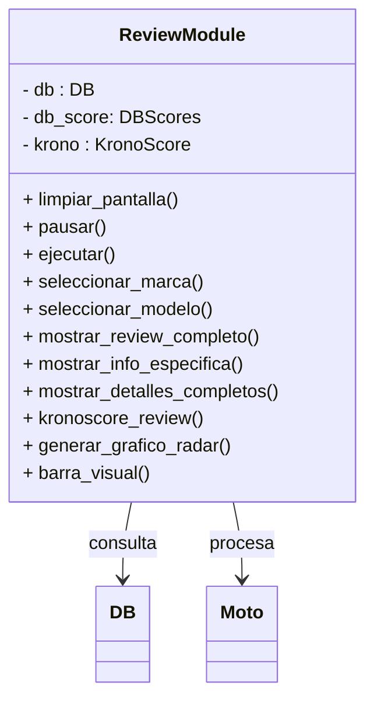
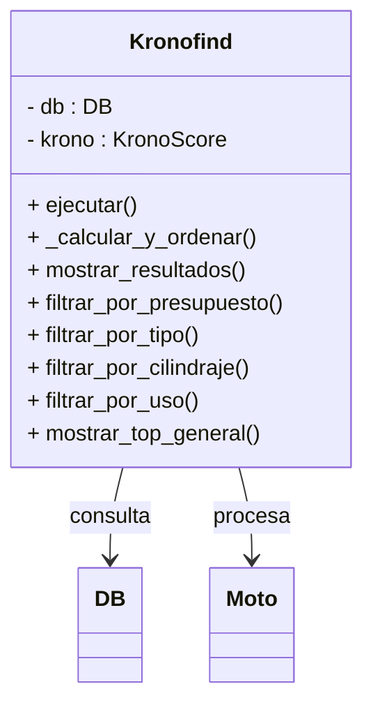
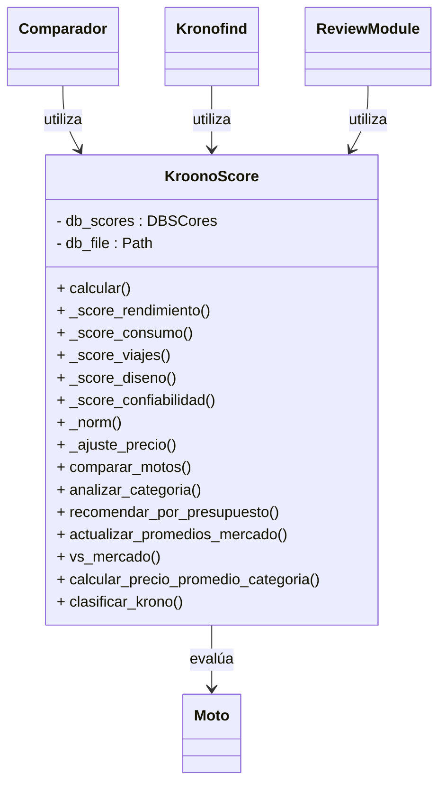
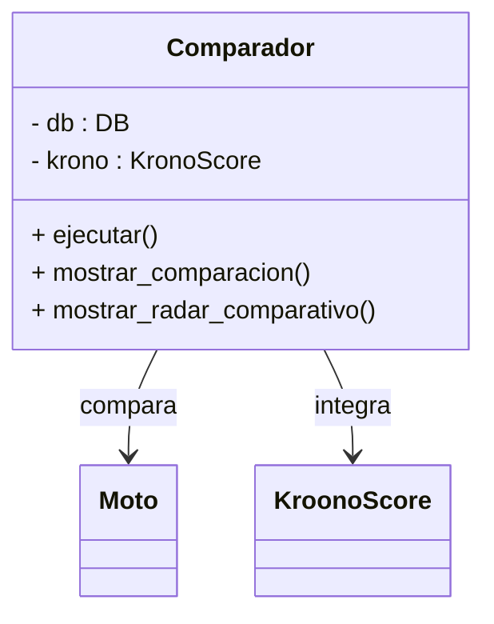
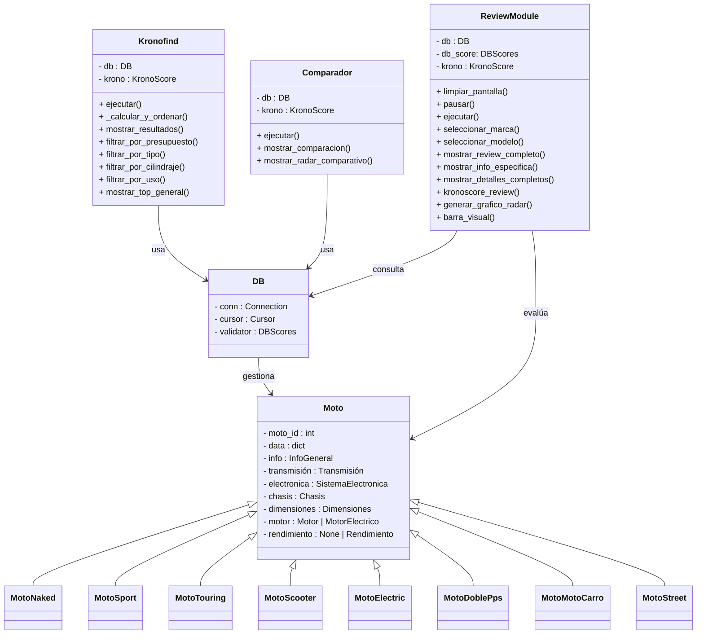

# proj_LVK
## Grupo: KROONOS


#### Integrantes
  - Lucas García
  - Kevin Castellanos
  - Vladimir Camargo

## Proyecto: Comparador y Análisis de Motocicletas en Python.


Look_Vike es una proyecto especializado en análisis y evaluación comparativa de motocicletas, diseñada para ayudar a compradores a tomar decisiones informadas basadas en datos técnicos y criterios objetivos.

Este programa implementa las bases de la POO, tratando que cada sección integre clases, metodos y objetos, junto con las herramientas que hacen parte de esta forma de programación y fue desarrollado en el lenguaje de programación Python.


## Objetivos
### General
- Simplificar el proceso de selección de motocicletas mediante herramientas de comparación y análisis que permitan al usuario identificar la mejor opción según sus necesidades específicas, presupuesto y preferencias de manejo.
### Especificos
- Implementar una arquitectura POO sólida con clases especializadas para diferentes tipos de motocicletas
- Desarrollar algoritmos de evaluación que calculen scores basados en múltiples criterios técnicos.
- Construir una base de datos estructurada de motocicletas con especificaciones técnicas completas
- Simplificar información técnica compleja para hacerla accesible a usuarios no expertos.
- Proporcionar recomendaciones personalizadas basadas en necesidades específicas del usuario.
- Implementar Webscrapping, contando asi información actualizada de cada motocicleta y Fabricante.

## Motivo
Este proyecto surge para solucionar un problema que algunos vivimos: buscar moto y mas sin tener experienca puede ser un caos. En un país con un mercado tan grande de dos ruedas, actualmente uno se puede perder en mil páginas o confiar en opiniones de redes sociales, por tanto, se necesita una herramienta que haga mas práctica esta tarea.
Con las herramientas aprendidas en el curso POO, identificamos que es posible crear algo cercano a dicha herramienta, ya que se pueden adaptar muchos conceptos del motociclismo a las bases del POO: Clases y Objetos.

## Programa

### Estructura del proyecto

```text
proj_Lkv/
│
├──  Core/             # Lógica de Negocio Pura
│   ├── __init__.py      # iniciador del paquete Core
│   ├── moto.py         # Modelado de clases (Composición) y Factory Method
│   └── kroono_score.py # Algoritmo matemático de puntuación
│
├──  Services/         # Controladores de la Aplicación
│   ├── __init__.py      # iniciador del paquete Services
│   ├── admin_kroonos.py # Gestión CRUD (Modo Administrador)
│   ├── kroono_find.py   # Motor de búsqueda y filtrado
│   ├── kroono_view.py   # Visualizador de fichas y gráficos
│   └── kroono_vs.py     # Comparador de motocicletas
│
├──  data/             # Capa de Persistencia
│   ├── __init__.py      # iniciador del paquete data
│   ├── db.py           # Gestor de conexión SQLite
│   ├── db_scores.py    # Validador y normalizador de datos
│   └── scores_db_init.py # Inicializador de tablas maestras
│
└──  Main/             # Punto de Entrada
    ├── __init__.py      # iniciador del paquete Main
    └── main.py         # Orquestador e Inyección de Dependencias
```

### Clase Principal: Moto
Representa cada motocicleta con sus características técnicas y capacidades de evaluación, con herencias de los tipos de motos que hay en el mercado con sus caracteristicas especiales, además de estar complementada por clases que manejan la búsqueda, comparación, y lógica de Score, todo esto se guarda en la base de datos.

### Base de Datos
Gestiona toda la persistencia de datos del sistema mediante archivos CSV. Actúa como el intermediario entre la aplicación y el almacenamiento permanente.

### Análisis de Motos
Entrega información destacada, junto con valores de calidad y precio para poder dar una recomendación al usuario, si este lo desea puede ver un gráfico donde se ve más a profundidad la puntuación obtenida, o también recibir un informe más detallado.

### Búsqueda de Motos
Realiza búsquedas inteligentes sobre el catálogo de motocicletas, a partir de los filtros que seleccione el usuario.

### KroonoScore
Calcula puntuaciones objetivas y estandarizadas para cada motocicleta, basadas en los componentes y el precio, dimensionando 5 apartados y dando una nota final de 1 al 10.

### Calculo de la calificación
Tal cual como se menciona en el pasado punto, el algoritmo Kroono_Score evualua 5 parametros, que a su vez poseen sus propios parametros:

#### Rendimiento
- HP
- Top Speed
- Suspensión
- Torque
- Trasmisión
- Peso
    
#### Diseño y Materiales
- Tipo Chasis
- Estética
- Instrumentos

#### Confort y Consumo
- Altura
- Autonomía
- Consumo
- Tanque
- Comodidad
- Ergonomía

#### Confiabilidad
- Fiabilidad de la Marca
- $ de Mantenimiento estimado
- Repuestos
- Reventa
- Gravedad de Fallas comunes
  
#### Seguridad
- Tipos de Frenos
- Iluminación
- Neumáticos
- Asistencias Electrónicas

Donde cada sub parametro recibe una calificación del 1-10 según el algoritmo, siendo el puntaje del parametro el promedio de sus subparámetros.

Tomaremos el ejemplo de la Pulsar NS 200, donde el algoritmo puntua de la siguiente forma:

```python
# Rendimiento

• HP: 24.5 HP @ 9750 rpm → 8/10 
• Top Speed: ~136 km/h → 7/10  
• Suspensión: Nitrox trasero, delantera telescópica → 7/10
• Torque: 18.6 Nm @ 8000 rpm → 7/10
• Transmisión: 6 velocidades → 9/10
• Peso: 156 kg  → 9/10

Promedio: (8+7+7+7+9+9)/6 = 47/6 = 7.83 → 7.8/10

# Diseño

• Tipo Chasis: Perimetral de acero  → 8/10
• Estética: Deportiva  → 8/10
• Instrumentos: Digital-analógico → 7/10

Promedio: (8+8+7)/3 = 30/4 = 7.6 → 7.6/10

# Confort y Consumo

• Altura:  → 6/10
• Autonomía: ~300 km  → 7/10
• Consumo: 30-35 km/L  → 8/10
• Tanque: 12 L  → 7/10
• Comodidad: Deportiva pero soportable → 7/10
• Ergonomía: → 7/10

Promedio: (6+7+8+7+7+7)/6 = 7.0 → 7.0/10

# Confiabilidad

• Fiabilidad de la Marca: Bajaj → 7/10
• $ Mantenimiento: Económico vs competencia → 8/10
• Repuestos: Disponibilidad media → 6/10
• Reventa: Buena en su segmento → 7/10
• Gravedad Fallas: Problemas eléctricos menores → 6/10

Promedio: (7+8+6+7+6)/5 = 34/5 = 6.8 → 6.8/10

# Seguridad

• Tipos de Frenos: Disco 280mm/del, 230mm/tras, ABS → 8/10
• Iluminación: Faros LED DRL (buena) → 8/10
• Neumáticos: MRF Zapper (decentes) → 6/10
• Asistencias: ABS mono canal (básico) → 6/10

Promedio: (8+8+6+6)/4 = 28/4 = 7.0 → 7.0/10
```
Una vez hecho esto, se calcula el promedio general y el precio promedio de una moto de la misma cilidrada.
Calculamos el cociente de precio como el cociente entre el precio real y el precio promedio

Aplicado al ejemplo...

```python
Cociente = 13.2/12.9
KronoScore = (7.22 × 10) ÷ 1.02 = 7.05/10
```

## Comparativa
Permite contrastar múltiples motocicletas simultáneamente, mostrando diferencias técnicas y generando visualizaciones para facilitar la decisión final del usuario.

## General
Aqui se muestra el funcionamiento de las clases antes descritas:


## Interacción con el usuario
### Menús
Se utilizan prints en la consola que le dan opciones al usuario para redirigirlo a las funciones que desea, cada menú que pasa se va borrando, permitiendo una interfaz limpia que facilita el entendimiento del usuario.

De manera general, para cada menu se utiliza un ciclo while para ingresar la opción deseada, para lo cual el programa hara comparaciones a través de condicionales, los cuáles permiten el avance entre distintos menús y entregan la información que el usuario requiere, al terminar selecciona la opción 0 en el menú principal y el programa termina finalmente.

### Gráficas de radar
A la hora de presentar resultados siempre se busca que sean lo más "digeribles" posible para el usuario, así, entregarle un conjunto de datos numéricos o booleanos realmente no ayudaría a la gruesa parte de la población sin tantos conocimientos técnicos sobre el tema, por tanto el equipo consideró que lo ideal sería poder representar las características de las motocicletas en un diagramas de radar en el que se pueda mostrar que tanto se especializa o es buena una determinada moto en un ambito, por ejemplo rendimiento y potencia.

Un ejemplo de cómo se vee este tipo de gráfico:
[](https://postimg.cc/30G6JW1w)

Por ende el usuario podrá apreciar estos gráficos tanto al a hora de ver el rendimiento de una moto en particular, como comparando dos de ellas.
## Aplicación del programa
### Instalación del programa
Para instalar el programa hay que seguir los pasos descritos a continuación:
- **Primero**: Hay que instalar el lenguaje de programación "python" en el sistema operativo.
Para esto se debe ingresar a la página oficial y [descargar python](https://www.python.org/downloads/) en la versión más actual posible para tu sistema operativo.

Si estas usando Windows puedes comprobar que la instalación haya funcionado abriendo la consola de Windows, presionando (win + r), y escribir "python --version", si funcionó debería responder con la versión descargada y ya se tendría al interprete instalado, no obstante, si no funcionó tendrás que descargalo directamente en la tienda de Microsoft para luego ya realizar comprobación y muy seguramente ya habrá funcionado.
  
- **Segundo**: Debes descargar la carpeta [proj_lvk](https://github.com/NotName-K/proj_Lkvk/tree/c9d9bbd94f192431447027eeba506275383c5667/proj_Lkv) de python y abrirla en un editor de código como puede ser [Visual Studio Code](https://code.visualstudio.com/download).
### Requerimientos
Para poder correr el código necesitas tener instalada la librería "matplotlib" en su versión más reciente, para ello dentro de la consola abierta en la carpeta ya instalada a través del editor de código, ingresa el siguiente comando:
```python
pip install matplotlib
```
En caso de no funcionar se requiera el descargar "pip", para eso revisar el siguiente [enlace](https://pip.pypa.io/en/stable/installation/).
### Cómo usarlo
Para usar el programa es bastante sencillo, el usuario debe ingresar al archivo [main.py](https://github.com/NotName-K/proj_Lkvk/blob/c9d9bbd94f192431447027eeba506275383c5667/proj_Lkv/Main/main.py) dentro de la carpeta "Main" al interior de "proj_lvk" y ejecutar el programa con el boton integrado en el editor de código.
