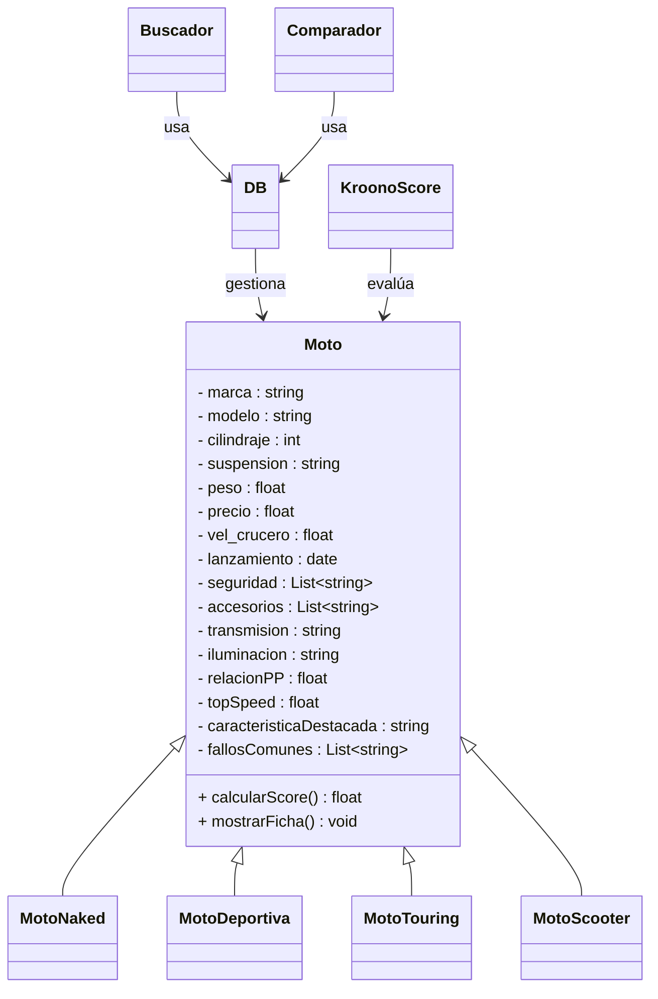
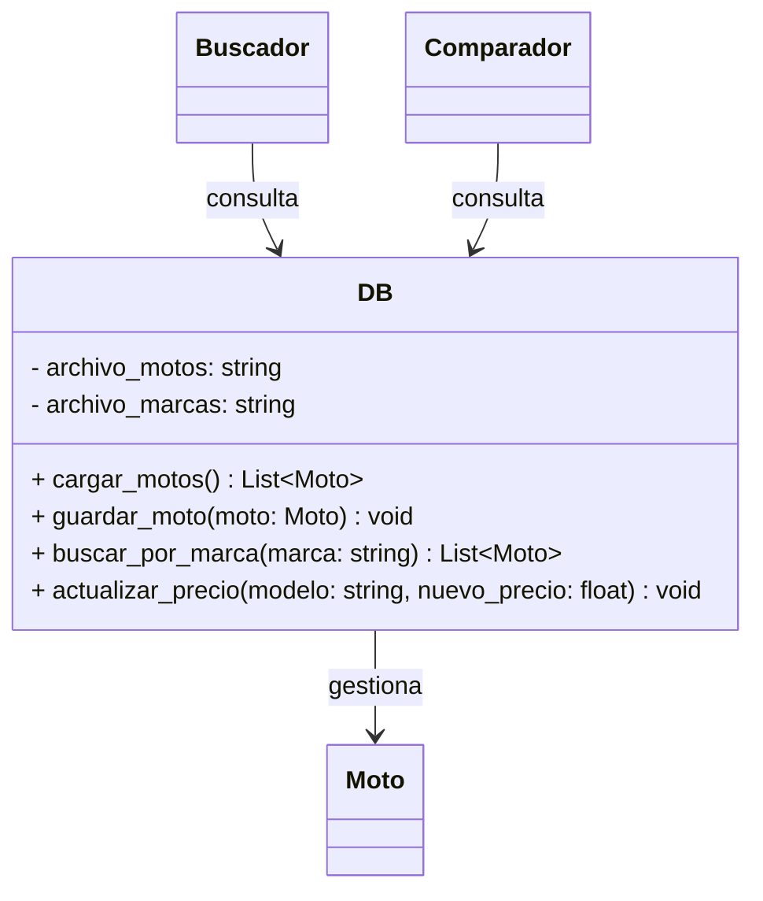
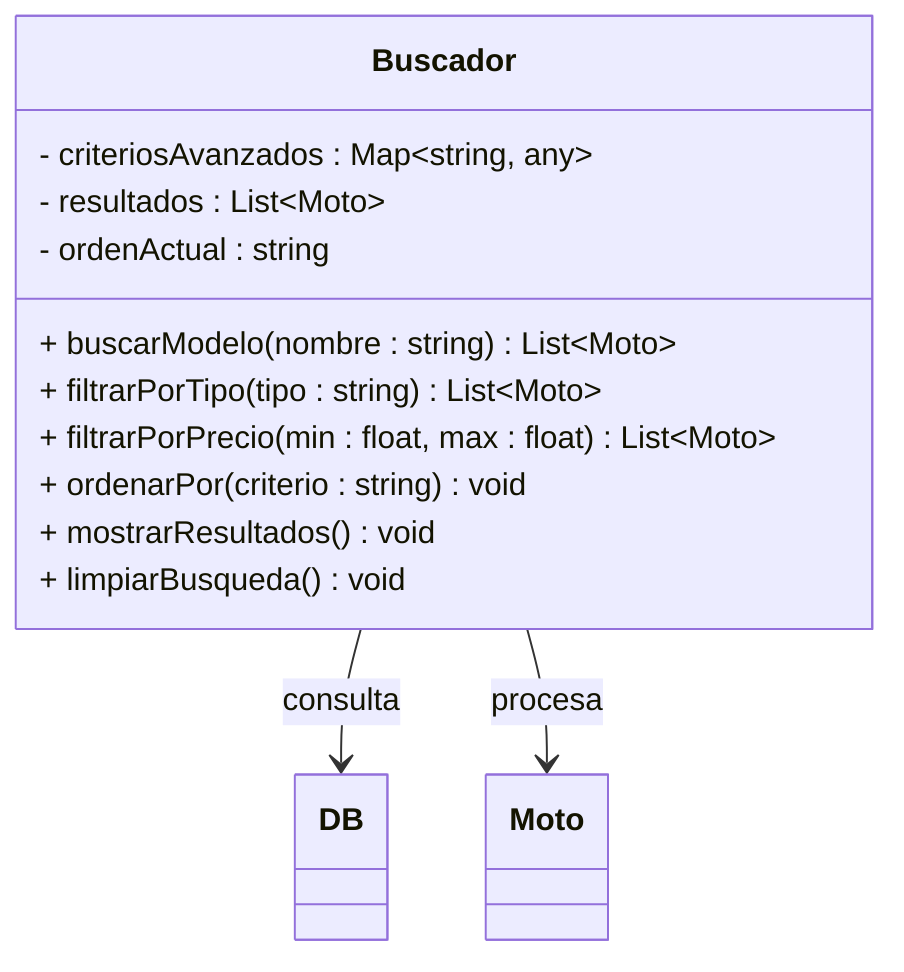
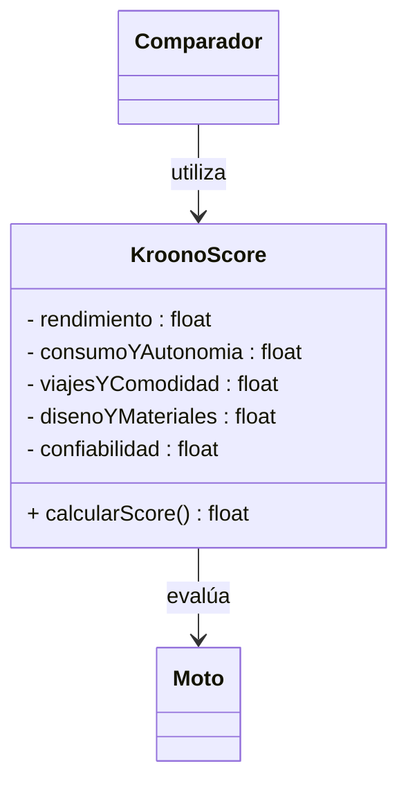
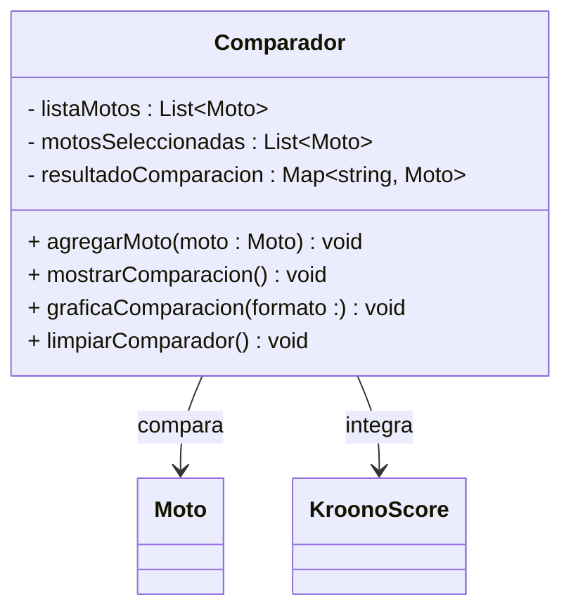
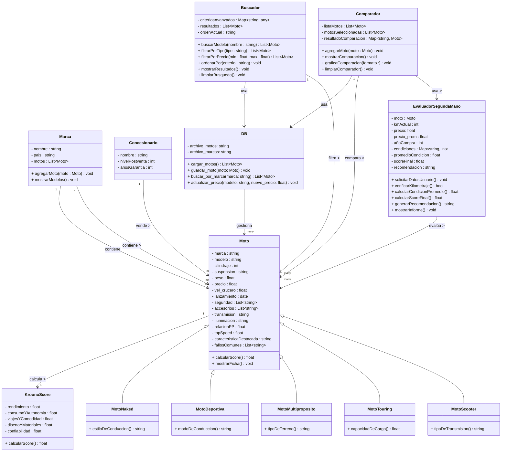

# proj_LVK
## Grupo: KROONS


#### Integrantes
  - Lucas García
  - Kevin Castellanos
  - Vladimir Camargo

## Proyecto: Comparador y Análisis de Motocicletas en Python.


Look_Vike es una proyecto especializado en análisis y evaluación comparativa de motocicletas, diseñada para ayudar a compradores a tomar decisiones informadas basadas en datos técnicos y criterios objetivos.

Este programa implementa las bases de la POO, tratando que cada sección integre clases, metodos y objetos, junto con las herramientas que hacen parte de esta forma de programación y fue desarrollado en el lenguaje de programación Python.


## Objetivos
### General
- Simplificar el proceso de selección de motocicletas mediante herramientas de comparación y análisis que permitan al usuario identificar la mejor opción según sus necesidades específicas, presupuesto y preferencias de manejo.
### Especificos
- Implementar una arquitectura POO sólida con clases especializadas para diferentes tipos de motocicletas
- Desarrollar algoritmos de evaluación que calculen scores basados en múltiples criterios técnicos.
- Construir una base de datos estructurada de motocicletas con especificaciones técnicas completas
- Simplificar información técnica compleja para hacerla accesible a usuarios no expertos.
- Proporcionar recomendaciones personalizadas basadas en necesidades específicas del usuario.
- Implementar Webscrapping, contando asi información actualizada de cada motocicleta y Fabricante.

## Motivo
Este proyecto surge para solucionar un problema que algunos vivimos: buscar moto y mas sin tener experienca puede ser un caos. En un país con un mercado tan grande de dos ruedas, actualmente uno se puede perder en mil páginas o confiar en opiniones de redes sociales, por tanto, se necesita una herramienta que haga mas práctica esta tarea.
Con las herramientas aprendidas en el curso POO, identificamos que es posible crear algo cercano a dicha herramienta, ya que se pueden adaptar muchos conceptos del motociclismo a las bases del POO: Clases y Objetos.

## Programa

### Estructura del proyecto

```text
proj_Lkv/
│
├── 📂 Core/             # Lógica de Negocio Pura
│   ├── __init__.py      # iniciador del paquete Core
│   ├── moto.py         # Modelado de clases (Composición) y Factory Method
│   └── kroono_score.py # Algoritmo matemático de puntuación
│
├── 📂 Services/         # Controladores de la Aplicación
│   ├── __init__.py      # iniciador del paquete Services
│   ├── admin_kroonos.py # Gestión CRUD (Modo Administrador)
│   ├── kroono_find.py   # Motor de búsqueda y filtrado
│   ├── kroono_view.py   # Visualizador de fichas y gráficos
│   └── kroono_vs.py     # Comparador de motocicletas
│
├── 📂 data/             # Capa de Persistencia
│   ├── __init__.py      # iniciador del paquete data
│   ├── db.py           # Gestor de conexión SQLite
│   ├── db_scores.py    # Validador y normalizador de datos
│   └── scores_db_init.py # Inicializador de tablas maestras
│
└── 📂 Main/             # Punto de Entrada
    ├── __init__.py      # iniciador del paquete Main
    └── main.py         # Orquestador e Inyección de Dependencias
```

### Clase Principal: Moto
Representa cada motocicleta con sus características técnicas y capacidades de evaluación, con herencias de los tipos de motos que hay en el mercado con sus caracteristicas especiales, además de estar complementada por clases que manejan la búsqueda, comparación, y lógica de Score, todo esto se guarda en la base de datos.

### Base de Datos
Gestiona toda la persistencia de datos del sistema mediante archivos CSV. Actúa como el intermediario entre la aplicación y el almacenamiento permanente.

### Análisis de Motos
Realiza búsquedas inteligentes sobre el catálogo de motocicletas, a partir de los filtros que seleccione el usuario.

### KroonoScore
Calcula puntuaciones objetivas y estandarizadas para cada motocicleta, basadas en los componentes y el precio, dimensionando 5 apartados y dando una nota final de 1 al 10.

### Calculo de la calificación
Tal cual como se menciona en el pasado punto, el algoritmo Kroono_Score evualua 5 parametros, que a su vez poseen sus propios parametros:

#### Rendimiento
- HP
- Top Speed
- Suspensión
- Torque
- Trasmisión
- Peso
    
#### Diseño y Materiales
- Tipo Chasis
- Estética
- Instrumentos


#### Confort y Consumo
- Altura
- Autonomía
- Consumo
- Tanque
- Comodidad
- Ergonomía
- 
#### Confiabilidad
- Fiabilidad de la Marca
- $ de Mantenimiento estimado
- Repuestos
- Reventa
- Gravedad de Fallas comunes
  
#### Seguridad
- Tipos de Frenos
- Iluminación
- Neumáticos
- Asistencias Electrónicas

Donde cada sub parametro recibe una calificación del 1-10 según el algoritmo, siendo el puntaje del parametro el promedio de sus subparámetros.

Tomaremos el ejemplo de la Pulsar NS 200, donde el algoritmo puntua de la siguiente forma:

```python
# Rendimiento

• HP: 24.5 HP @ 9750 rpm → 8/10 
• Top Speed: ~136 km/h → 7/10  
• Suspensión: Nitrox trasero, delantera telescópica → 7/10
• Torque: 18.6 Nm @ 8000 rpm → 7/10
• Transmisión: 6 velocidades → 9/10
• Peso: 156 kg  → 9/10

Promedio: (8+7+7+7+9+9)/6 = 47/6 = 7.83 → 7.8/10

# Diseño

• Tipo Chasis: Perimetral de acero  → 8/10
• Estética: Deportiva  → 8/10
• Instrumentos: Digital-analógico → 7/10

Promedio: (8+8+7)/3 = 30/4 = 7.6 → 7.6/10

# Confort y Consumo

• Altura:  → 6/10
• Autonomía: ~300 km  → 7/10
• Consumo: 30-35 km/L  → 8/10
• Tanque: 12 L  → 7/10
• Comodidad: Deportiva pero soportable → 7/10
• Ergonomía: → 7/10

Promedio: (6+7+8+7+7+7)/6 = 7.0 → 7.0/10

# Confiabilidad

• Fiabilidad de la Marca: Bajaj → 7/10
• $ Mantenimiento: Económico vs competencia → 8/10
• Repuestos: Disponibilidad media → 6/10
• Reventa: Buena en su segmento → 7/10
• Gravedad Fallas: Problemas eléctricos menores → 6/10

Promedio: (7+8+6+7+6)/5 = 34/5 = 6.8 → 6.8/10

# Seguridad

• Tipos de Frenos: Disco 280mm/del, 230mm/tras, ABS → 8/10
• Iluminación: Faros LED DRL (buena) → 8/10
• Neumáticos: MRF Zapper (decentes) → 6/10
• Asistencias: ABS mono canal (básico) → 6/10

Promedio: (8+8+6+6)/4 = 28/4 = 7.0 → 7.0/10
```
Una vez hecho esto, se calcula el promedio general y el precio promedio de una moto de la misma cilidrada.
Calculamos el cociente de precio como el cociente entre el precio real y el precio promedio

Aplicado al ejemplo...

```python
Cociente = 13.2/12.9
KronoScore = (7.22 × 10) ÷ 1.02 = 7.05/10
```

## Comparativa
Permite contrastar múltiples motocicletas simultáneamente, mostrando diferencias técnicas y generando visualizaciones para facilitar la decisión final del usuario.

## General
Aqui se muestra el funcionamiento de las clases antes descritas:


## Apartado Gráfico y Menús
Se utilizan prints en la consola donde el usuario ingresa números para escoger ciertas opciones.
```python
bandera : bool = True
    I1 : str = """
        Bienvenido a Look_Vike, comparador de motocicletas \n
            |        Menú Principal       |
            |  1  |  Buscador             |
            |  2  |  Comparador           |
            |  3  |  Cerrar el programa   |
        """
    I2 : str = """
            Opciones de Buscador:
            |    Seleccione una opción    |
            |  1  |    Buscar modelos     |
            |  2  |      Filtrar          |
            |  3  |      Ordenar          |
            |  4  |  Limpiar búsqueda     |
            |  5  |       Atrás           |
        """
    I3 : str = """
            Opciones de Comparación:
            |    Seleccione una opción    |
            |  1  | Agregar moto          |
            |  2  | Comparación           |
            |  3  | Lista ordenada        |
            |  4  | Limpiar comparador    |
            |  5  |       Atrás           |
        """
        # Se guardan las interfaces en un diccionario para facilitar su transporte entre funciones
    Interfaces: dict = {"General": I1,"Buscador":I2, "Comparador": I3}
        
        # Se llama a la función del menú y se ingresan las interfaces junto con la bandera
    menu(Interfaces, bandera)
```
De manera general, para cada menu se utiliza un ciclo while para ingresar la opción, añadiendo un caso de Except si hay un ValueError, y luego se utiliza la estructura mathc-case para derivar al usuario a la función que controla la opción seleccionada, por ejemplo terminar el programa.
```python
def menu(Interfaces: dict, bandera: bool):
    while bandera == True:
        # Mostrar el menú
        print(Interfaces["General"])
        # Se elige una opción de la interfaz mostrada
        try:
            a = int(input("Seleccione una opción: "))
        except ValueError:
            print("Por favor, ingrese un número entero válido.")
            continue
            
        # Ejecutar la opción seleccionada
        match a: # Se redirige a la función deseada por el usuario
            case 1:
                buscador(Interfaces)
            case 2:
                comparador(Interfaces)
            case 3:
                print("Fin del programa")
                bandera = False # Se actualiza la bandera para dar fin al bucle y al programa
            case _:
                print("Opción no válida. Por favor, ingrese un número entre 1 y 3.")
```
### Gráficas de estrella
A la hora de presentar resultados siempre se busca que sean lo más "digeribles" posible para el usuario, así, entregarle un conjunto de datos numéricos o booleanos realmente no ayudaría a la gruesa parte de la población sin tantos conocimientos técnicos sobre el tema, por tanto el equipo considera que lo ideal sería poder representar las características de las motocicletas en una especie de "Diagramas de Estrella" que puedan mostrar que tanto se especializa o es buena una determinada moto en un ambito, por ejemplo ahorro de gasolina.

Un ejemplo de cómo se vería este tipo de gráfico:
[](https://postimg.cc/30G6JW1w)

